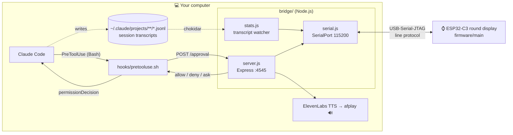
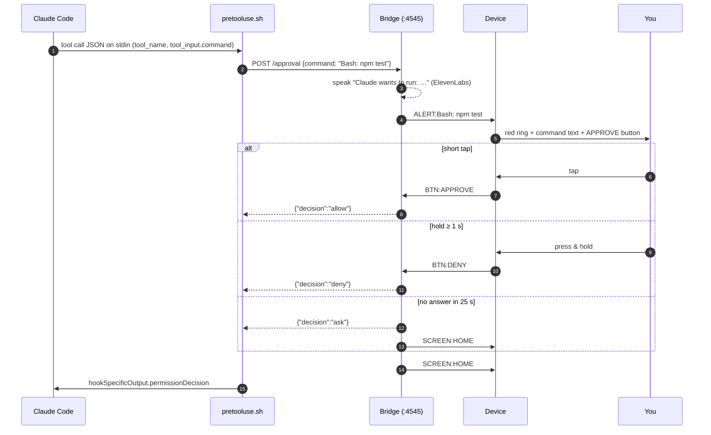

<!--
  HERO IMAGE / ICON PLACEHOLDERS
  When the artwork is ready, drop the files into docs/images/ and uncomment:

  <p align="center">
    
  </p>
  <p align="center">
    
  </p>
-->

<h1 align="center">⌚ watch-my-tokens</h1>

<p align="center">
  <b>A round, touch-screen desk companion for Claude Code.</b><br/>
  See your active agents, context usage, and spend at a glance, and approve or deny
  Claude's shell commands with a tap, without ever switching windows.
</p>

<p align="center">
  
  
  
  
  
  
</p>

---

## Table of contents

1. [What it does](#-what-it-does)
2. [How it works](#-how-it-works)
3. [Hardware](#-hardware)
4. [Repository layout](#-repository-layout)
5. [Components in detail](#-components-in-detail)
   - [Firmware (ESP32-C3)](#1-firmware-esp32-c3)
   - [Bridge server (Node.js)](#2-bridge-server-nodejs)
   - [Claude Code hook](#3-claude-code-pretooluse-hook)
6. [Serial protocol](#-serial-protocol)
7. [Requirements](#-requirements)
8. [Setup & running](#-setup--running)
9. [Configuration reference](#-configuration-reference)
10. [Cost & usage accuracy](#-cost--usage-accuracy)
11. [Troubleshooting](#-troubleshooting)
12. [Known issues & limitations](#-known-issues--limitations)
13. [Code conventions](#-code-conventions)
14. [Project history](#-project-history)
15. [Roadmap ideas](#-roadmap-ideas)

---

## ✨ What it does

**watch-my-tokens** (called *AgentPager* inside the code) turns a tiny 1.28″ round
ESP32 display into a physical dashboard and remote control for
[Claude Code](https://claude.com/claude-code).

| | Feature | Details |
|---|---|---|
| 📊 | **Live usage dashboard** | A glowing ring shows how full the busiest session's context window is, along with the number of active agents and the dollar cost of those sessions. |
| 🚨 | **Command approval pager** | When Claude Code wants to run a `Bash` command, the device lights up red, shows the command, and waits for your decision. |
| 👆 | **Tap to allow, hold to deny** | A short tap **approves**. Pressing and holding for 1 second **denies**, and the button pulses from amber to red while you hold it. |
| ✅ | **Clear feedback** | You get a full-screen green ✓ flash on approve and a red ✕ flash on deny, followed by an automatic return to the dashboard. |
| 🔊 | **Spoken alerts** | Every approval request is read aloud ("*Claude wants to run: …*") using ElevenLabs text-to-speech, so you notice it even when you're looking away. A new alert or a button press cuts off any speech still playing, so voices never overlap. |
| ⏱️ | **Safe fallback** | If nobody answers within 25 s, or the bridge isn't running, Claude Code falls back to its normal on-screen permission prompt. It never silently allows anything. |
| 💤 | **Idle decay** | Sessions that have been quiet for 60 s drop out of the agent count, and the dashboard refreshes every 10 s so it settles back to zero. |

---

## 🧠 How it works

The system has three parts. **Claude Code** runs a hook before each Bash tool call.
The hook asks a local **bridge server**, and the bridge talks to the **device** over USB serial.



### Approval flow



### Stats flow

1. `stats.js` watches every `*.jsonl` transcript under `~/.claude/projects/` with **chokidar**.
2. On each file change, it reads **only the new bytes** (it remembers a per-file offset), then parses each line as JSON.
3. For every `assistant` entry that carries `message.usage`, it:
   - adds up the **turn cost** from input, output, cache-write, and cache-read tokens at Claude Sonnet 5 rates (see [Configuration](#-configuration-reference), and [Cost & usage accuracy](#-cost--usage-accuracy) for the caveats),
   - records the **context size** of that turn (`input + cache_creation + cache_read`),
   - updates the session's `lastSeen` timestamp.
4. A session counts as **active** if it produced output in the last 60 s.
5. The summary is sent to the device as `STATS:<agents>:<pct>:<cost>`, where
   - `agents` is the number of active sessions,
   - `pct` is the context fill of the *busiest* active session (out of 200,000 tokens), capped at 100,
   - `cost` is the total USD across active sessions.
6. The summary is emitted after every transcript change **and** every 10 s, which lets idle sessions decay off the screen.

---

## 🔩 Hardware

| Part | Notes |
|---|---|
| **ESP32-2424S012C** dev board | ESP32-C3 (RISC-V, 160 MHz; the firmware is configured for 2 MB flash), USB-C wired to the chip's native **USB-Serial-JTAG** |
| **GC9A01** 1.28″ round IPS LCD | 240 × 240, RGB565, SPI at 40 MHz |
| **CST816D** capacitive touch | I²C at 400 kHz, address `0x15` |
| USB-C data cable | Powers the board, and carries both flashing and the serial protocol |

### Pinout (as used in firmware)

| Function | GPIO | | Function | GPIO |
|---|---|---|---|---|
| LCD MOSI | 7 | | Touch SDA | 4 |
| LCD SCLK | 6 | | Touch SCL | 5 |
| LCD CS | 10 | | Touch INT | 0 *(unused, polled)* |
| LCD DC | 2 | | Touch RST | 1 |
| LCD RST | — *(software reset)* | | | |
| Backlight | 3 | | | |

---

## 🗂 Repository layout

```text
watch-my-tokens/
├── README.md                ← you are here
├── bridge/                  ← Node.js bridge between Claude Code and the device
│   ├── index.js             ← entry point: wires serial + stats + HTTP together
│   ├── serial.js            ← AgentPagerSerial: line-based SerialPort wrapper (EventEmitter)
│   ├── server.js            ← Express app: /approval, /debug/log, ElevenLabs TTS
│   ├── stats.js             ← StatsTracker: tails Claude Code transcripts, computes usage/cost
│   ├── package.json
│   └── .env                 ← ELEVENLABS_API_KEY (not committed)
├── hooks/
│   └── pretooluse.sh        ← Claude Code PreToolUse hook → asks the bridge for a decision
└── firmware/                ← ESP-IDF project for the ESP32-C3
    ├── CMakeLists.txt
    ├── dependencies.lock    ← pinned component versions
    ├── sdkconfig.ci
    └── main/
        ├── CMakeLists.txt
        ├── idf_component.yml← depends on esp_lvgl_port + esp_lcd_gc9a01
        ├── main.c           ← display/LVGL init, UI, serial protocol, button logic, animations
        ├── touch_driver.c   ← CST816D driver (new i2c_master API) + LVGL indev callback
        └── touch_driver.h   ← touch pins, register map, gesture IDs, timings
```

---

## 🧩 Components in detail

### 1. Firmware (ESP32-C3)

**Stack:** ESP-IDF **v6.0.2**, FreeRTOS, LVGL **9.6** via `espressif/esp_lvgl_port` **2.9.0**,
and `espressif/esp_lcd_gc9a01` **2.0.4**. Target: `esp32c3`.

#### Boot sequence (`app_main`)

1. Installs the **USB-Serial-JTAG** driver. This board's USB-C port only exposes USB-Serial-JTAG, not UART0, so all host I/O goes through it.
2. Turns on the backlight (GPIO 3).
3. Starts the **SPI2** bus and the GC9A01 panel IO at 40 MHz, then resets and inits the panel, inverts colours, and switches the display on.
4. Starts the **LVGL port** with a 240×24-line DMA buffer, mirror-X rotation, and byte swapping for RGB565.
5. Draws the UI (see below).
6. Starts `serial_read_task`, which reads bytes, assembles lines of up to 127 characters, and calls `handle_line()`.
7. Starts the **CST816D** touch controller. It registers an LVGL pointer input device with a **1000 ms long-press time**, and starts a diagnostic `touch_read_task` that logs raw coordinates.

#### UI

| Element | Home state | Alert state |
|---|---|---|
| **Arc ring** (228 px, full 360°) | Amber `#FF9500` fill = context %. Turns red `#FF3B30` at ≥ 80 % | Full red ring with a red glow shadow |
| **Top label** (Montserrat 28) | `N AGENTS` | `APPROVE?` |
| **Middle label** (unscii 16) | `TOKENS NN%` | The command text (wraps) |
| **Bottom label** (unscii 16, green) | `$X.XX today` | hidden |
| **APPROVE button** (pill, 120×40) | hidden | visible, amber |

#### Button interaction

- **Short click, released before 1 s:** sends `BTN:APPROVE`, then plays the green ✓ overlay (holds for 500 ms, then fades out over 200 ms).
- **Long press, held for 1 s or more:** sends `BTN:DENY`, then plays the red ✕ overlay (same timing).
- **While held:** the button colour blends from amber toward red in proportion to the hold time and flickers every 100 ms, so it feels like it's "charging" toward a deny.
- Both actions **reset the screen locally right away**, so the device doesn't wait for the bridge to redraw.
- While an alert is showing, incoming `STATS:` updates are ignored so the command stays readable.

#### Touch driver (`touch_driver.c/.h`)

- Uses the **new** ESP-IDF `driver/i2c_master.h` API, not the legacy `driver/i2c.h`.
- Hardware-resets the chip on startup: RST is held low for 10 ms, then there is a 50 ms wait.
- Reads a 6-byte report starting at register `0x01` (gesture, touch count, and 12-bit X/Y), clamps coordinates to 240×240, and exposes:
  - `cst816d_read_raw()`: a plain diagnostic read,
  - `cst816d_read()`: the LVGL `read_cb`.
- Gesture IDs (swipe up/down/left/right, long press) are defined for future use.

---

### 2. Bridge server (Node.js)

The bridge runs on your computer. It owns the serial port and is the only thing that talks to the device.

| File | Responsibility |
|---|---|
| `index.js` | Opens the serial port `/dev/tty.usbmodem101`, starts `StatsTracker`, forwards summaries as `STATS:` lines, runs a 10 s summary heartbeat, and starts HTTP on **:4545**. Logs all serial traffic. |
| `serial.js` | `AgentPagerSerial` wraps `serialport` at **115200 baud** with a newline `ReadlineParser`. It emits `line`, `approve` (`BTN:APPROVE`), `deny` (`BTN:DENY`), `ready` (`READY`), `open`, `close`, and `error`. `send()` adds `\n` and drops messages if the port is closed. |
| `server.js` | The Express app (details below). |
| `stats.js` | `StatsTracker`, which tails transcripts incrementally and computes the agents / pct / cost summary (see [Stats flow](#stats-flow)). |

#### HTTP API

| Method & path | Body | Response | Behaviour |
|---|---|---|---|
| `POST /approval` | `{ "command": "Bash: ls -la" }` | `{ "decision": "allow" \| "deny" \| "ask" }` | Holds the request open until the device answers or **25 s** pass. Only **one** approval can be pending at a time; any concurrent request gets `ask` right away. Sends `ALERT:<command>` and speaks the command. On timeout it replies `ask` and sends `SCREEN:HOME`. |
| `POST /debug/log` | `{ "approved": 3, "denied": 1 }` *(optional)* | `{ sent, approved, denied }` | Sends `SCREEN:LOG:<approved>:<denied>` to show the tally screen. Without a body, it uses the bridge's running approve/deny counts. |

#### Voice alerts

`speakAlert()` calls ElevenLabs `POST /v1/text-to-speech/EXAVITQu4vr4xnSDxMaL` with the `eleven_turbo_v2_5` model.
It writes the MP3 to `/tmp/agentpager-alert.mp3` and plays it with macOS `afplay`, keeping a handle to the player process.

`stopSpeaking()` kills that process (if any). It runs:
- at the start of every new alert, so a second alert never talks over the first;
- when the device sends `BTN:APPROVE` or `BTN:DENY`, so the voice stops as soon as you decide.
If this step fails, it only logs an error; approvals still work.

---

### 3. Claude Code PreToolUse hook

`hooks/pretooluse.sh` is registered in `~/.claude/settings.json` as a **PreToolUse** hook for the **Bash** tool:

1. Reads the tool-call JSON from stdin and pulls out `tool_name` and `tool_input.command` (falling back to `tool_input.description`).
2. Posts `{"command": "<tool>: <command>"}` to `http://localhost:4545/approval` with a **28 s** curl timeout, slightly longer than the bridge's 25 s.
3. Maps the result to Claude Code's hook output format:

| Bridge decision | `permissionDecision` | Reason shown |
|---|---|---|
| `allow` | `allow` | Approved on AgentPager device |
| `deny` | `deny` | Denied on AgentPager device |
| `ask` / unreachable / timeout | `ask` | AgentPager did not respond in time; falling back to normal prompt |

It **fails open to the normal prompt, never to auto-allow**. If the bridge is down, you just see Claude Code's usual permission dialog.

---

## 📡 Serial protocol

All messages are plain ASCII lines ending in `\n` (the device also accepts `\r`), at 115200 baud over USB-Serial-JTAG.

**Host → device**

| Message | Example | Effect |
|---|---|---|
| `STATS:<agents>:<pct>:<cost>` | `STATS:2:47:1.83` | Updates the ring, agent count, token %, and cost. Ignored while an alert is showing. |
| `ALERT:<text>` | `ALERT:Bash: rm -rf build` | Enters approval mode. |
| `SUMMARY:<text>` | `SUMMARY:Deletes the build dir` | Replaces the command text while an alert is showing. |
| `SCREEN:HOME` | | Leaves alert mode and restores the dashboard styling. |
| `SCREEN:LOG:<approved>:<denied>` | `SCREEN:LOG:5:1` | Shows the approve/deny tally in the top label. |

**Device → host**

| Message | Meaning |
|---|---|
| `BTN:APPROVE` | The user tapped the button. |
| `BTN:DENY` | The user held the button for at least 1 s. |
| `READY` | *(recognised by the bridge; not sent by the current firmware)* |

> The device also prints ESP-IDF log lines (`I (1234) main: …`) on the same port. The bridge logs them and otherwise ignores them.

---

## 🧰 Requirements

### Hardware
- [ ] ESP32-2424S012C round display board (ESP32-C3 + GC9A01 + CST816D)
- [ ] USB-C **data** cable (some cables only carry power)

### Software: computer
| Tool | Version used | Why |
|---|---|---|
| **macOS** | 15 (Darwin 24) | `afplay` for voice alerts, and the `/dev/tty.usbmodem*` port naming |
| **Node.js** | 18+ (developed on 23.6) | Runs the bridge. Needs the global `fetch` API |
| **npm** | bundled with Node | Installs the bridge dependencies |
| **ESP-IDF** | **v6.0.2** | Builds and flashes the firmware (`idf.py`) |
| **jq** | any | JSON parsing in the hook script (`brew install jq`) |
| **curl** | any (built in) | The hook uses it to call the bridge |
| **Claude Code** | recent, with hooks support | The thing being watched |

### Accounts / keys
| Key | Where | Required? |
|---|---|---|
| `ELEVENLABS_API_KEY` | `bridge/.env` | Optional. Without it, voice alerts fail with a logged error and everything else works |

### npm dependencies (`bridge/package.json`)
`express` · `serialport` · `@serialport/parser-readline` · `chokidar` · `dotenv`

### ESP-IDF components (fetched automatically by the component manager)
`espressif/esp_lvgl_port` · `espressif/esp_lcd_gc9a01` · `lvgl/lvgl` · `espressif/cmake_utilities`

---

## 🚀 Setup & running

### 1. Clone

```bash
git clone <this-repo> watch-my-tokens
cd watch-my-tokens
```

### 2. Build & flash the firmware

```bash
# one-time: install ESP-IDF v6.0.2 (see Espressif's getting-started guide), then in each shell:
. $HOME/.espressif/v6.0.2/esp-idf/export.sh

cd firmware
idf.py set-target esp32c3        # first time only
idf.py build
idf.py -p /dev/tty.usbmodem101 flash monitor   # Ctrl+] to leave the monitor
```

You should see the amber ring with **0 AGENTS · TOKENS 0% · $0.00 today**.
Close the monitor before starting the bridge, because only one program can hold the serial port.

### 3. Start the bridge

```bash
cd bridge
npm install
echo "ELEVENLABS_API_KEY=your_key_here" > .env   # optional
npm start
```

Expected output:

```text
[http] approval server listening on :4545
[serial] connected on /dev/tty.usbmodem101
[stats] agents=0 pct=0% cost=$0.00
```

> Is your board on a different port? Run `ls /dev/tty.usbmodem*` and change `PORT_PATH` in `bridge/index.js`.

### 4. Install the Claude Code hook

```bash
chmod +x hooks/pretooluse.sh
```

Add the hook to `~/.claude/settings.json` (or to a project's `.claude/settings.json`):

```json
{
  "hooks": {
    "PreToolUse": [
      {
        "matcher": "Bash",
        "hooks": [
          {
            "type": "command",
            "command": "/absolute/path/to/watch-my-tokens/hooks/pretooluse.sh",
            "timeout": 30
          }
        ]
      }
    ]
  }
}
```

### 5. Try it

Start Claude Code and ask it to run a shell command. The device should flash red and read the command aloud.
**Tap** to approve, or **hold** to deny.

Quick manual tests without Claude Code:

```bash
# simulate an approval request (blocks until you tap/hold or 25 s pass)
curl -X POST localhost:4545/approval -H 'Content-Type: application/json' \
     -d '{"command":"Bash: echo hello"}'

# show the approve/deny log screen
curl -X POST localhost:4545/debug/log -H 'Content-Type: application/json' \
     -d '{"approved":4,"denied":1}'
```

---

## ⚙️ Configuration reference

| Setting | Location | Default |
|---|---|---|
| Serial port | `bridge/index.js` → `PORT_PATH` | `/dev/tty.usbmodem101` |
| HTTP port | `bridge/index.js` → `HTTP_PORT` (also `BRIDGE_URL` in the hook) | `4545` |
| Stats heartbeat | `bridge/index.js` → `setInterval` | 10 s |
| Approval timeout | `bridge/server.js` → `APPROVAL_TIMEOUT_MS` | 25 s |
| Hook curl timeout | `hooks/pretooluse.sh` → `CURL_TIMEOUT` | 28 s |
| TTS voice / model | `bridge/server.js` → `speakAlert()` | `EXAVITQu4vr4xnSDxMaL` / `eleven_turbo_v2_5` |
| Active-session window | `bridge/stats.js` → `ACTIVE_WINDOW_MS` | 60 s |
| Ring "100 %" scale | `bridge/stats.js` → `SONNET_CONTEXT_WINDOW` | 200,000 tokens *(Sonnet 5's real window is 1M; see below)* |
| Pricing ($ / 1M tokens) | `bridge/stats.js` → `PRICE_*` | input 2.00 · output 10.00 · cache write 2.50 · cache read 0.20 |
| Long-press (deny) time | `firmware/main/main.c` → `lv_indev_set_long_press_time` | 1000 ms |
| Red-ring threshold | `firmware/main/main.c` → `handle_line` | ≥ 80 % |
| Display / touch pins | `main.c` / `touch_driver.h` | see [Pinout](#pinout-as-used-in-firmware) |

---

## 💲 Cost & usage accuracy

While documenting `stats.js`, I compared its numbers against the current Claude API pricing and against real Claude Code transcripts.
The **per-token rates are correct for Claude Sonnet 5**, but a few assumptions make the dashboard numbers approximate.
The code comments now describe these; the behaviour is unchanged.

| # | What the code does | Reality | Effect on the device |
|---|---|---|---|
| 1 | Counts every `assistant` line in a transcript. | Claude Code writes **one line per content block** (text, tool call, …), and each line repeats the same `message.usage`. In one real session, 44 lines covered 20 API messages. | 💲 **Cost is overstated**, roughly 2× in typical tool-heavy sessions. It should de-duplicate by `message.id`. |
| 2 | Prices everything at **Sonnet 5** rates: $2 in / $10 out / $2.50 cache write / $0.20 cache read per MTok. | Sessions can run on any model (e.g. this repo's own sessions use `claude-opus-5-5` at $4 / $20). The model is recorded in `message.model`. | 💲 Cost is wrong whenever the session isn't on Sonnet 5. |
| 3 | Prices all cache writes at the **5-minute TTL** rate (1.25× input). | Claude Code's cache writes are mostly **1-hour TTL** (2× input = $4.00/MTok on Sonnet 5). The split is in `usage.cache_creation.ephemeral_1h_input_tokens` / `ephemeral_5m_input_tokens`. | 💲 Cache-write cost is understated by about 37 %. |
| 4 | Treats 200,000 tokens as a full context window. | Sonnet 5, Opus 5.5 and Fable 5.1 have a **1,000,000-token** window (Haiku 4.5 has 200K). | 🟠 The ring reads 5× fuller than the real window. It is still useful as a "this session is getting big" gauge. |
| 5 | Labels the total `$X.XX today`. | It's the sum over sessions active in the last 60 s, accumulated since the bridge started. | 🏷️ The label is misleading; it isn't a daily total. |

Fixing 1–3 means de-duplicating by `message.id`, choosing the rate table from `message.model`, and splitting cache writes by TTL.
Fixing 4 is a one-line constant change, if you'd rather the ring show the true window.

---

## 🩺 Troubleshooting

| Symptom | Fix |
|---|---|
| `[serial] error: Error: No such file or directory` | The board isn't on `/dev/tty.usbmodem101`. Run `ls /dev/tty.usbmodem*` and update `PORT_PATH`. |
| `Resource busy` on the serial port | `idf.py monitor` (or another serial tool) is still open. Close it. |
| Screen is blank / backlight off | Re-flash, and check the USB cable carries data. Look for `Setup complete` in `idf.py monitor`. |
| Touch doesn't respond | Look for `cst816d_init failed` in the monitor. The `TOUCH x=… y=…` log lines confirm the chip is reporting. |
| Claude Code shows its normal prompt instead of the device | Make sure the bridge is running on :4545 and `jq` is installed. Check that the hook path is absolute and executable. |
| No voice | Check `ELEVENLABS_API_KEY` in `bridge/.env`, and look for `[elevenlabs] failed:` in the bridge log. |
| Agent count stays at 0 | The bridge only counts sessions whose transcript got an assistant message in the last 60 s. Make sure `~/.claude/projects/` exists. |

---

## ⚠️ Known issues & limitations

Current limitations of the project:

- **One approval at a time:** if two agents ask at once, the second one gets `ask` right away and falls back to the normal prompt.
- **Only `Bash` is gated:** the hook matcher is `Bash`. Other tools (Edit, Write, and so on) aren't sent to the device.
- **Cost and context % are approximations:** see [Cost & usage accuracy](#-cost--usage-accuracy).
- **Voice can play after you decide:** `stopSpeaking()` only stops audio that is already playing. If you tap or hold while the ElevenLabs request is still downloading, that clip starts playing afterwards.
- **macOS-only audio:** voice playback uses `afplay`. On Linux or Windows, swap in another player.
- **Hard-coded serial port:** there's no auto-detection yet.
- **Leftovers:** `firmware/README.md` and `firmware/pytest_hello_world.py` come from the ESP-IDF *hello_world* template.

---

## 📝 Code conventions

Every source file starts with a header comment explaining what it's for. Every function documents its purpose, parameters, return value and side effects:

| Language | Style | Example tags |
|---|---|---|
| JavaScript (`bridge/`) | [JSDoc](https://jsdoc.app/) | `@file`, `@param {type}`, `@returns`, `@private`, `@extends` |
| C (`firmware/main/`) | [Doxygen](https://www.doxygen.nl/) | `@file`, `@brief`, `@param`, `@return` |
| Bash (`hooks/`) | Header block | Input (stdin), Output (stdout), Exit status, Dependencies |

Please keep new code in the same style.

---

## 📜 Project history

| Commit | Milestone |
|---|---|
| `a1f0dc6` | Initial commit |
| `1981258` | Basic ESP-IDF firmware structure for the ESP32-C3 |
| `4d8fb96` | Working firmware receiving commands as inline text; Node bridge server implemented |
| `7b8e7c0` | Auto-decay for idle agents; reduced usage arc |
| `f4d7c90` | Default action on timeout; button grows on press; **long-press = deny, tap = approve** |
| `91c3b1a` | **ElevenLabs** voice read-out of incoming commands |
| `37ac11c` | Green ✓ / red ✕ **allow & deny animations**; fixed screen transition bug |
| `d3edb9c` | Stopped tracking `bridge/node_modules/` and `package-lock.json` |
| `f0bdd88` | Hook falls back to `ask`; removed shadowed duplicate button handlers |
| `77ef678` | Added this README |
| `e53eb8d` | **`stopSpeaking()`**: voice alerts no longer talk over each other; ElevenLabs `eleven_turbo_v2_5` |
| — | JSDoc / Doxygen comments across the codebase; cost-accuracy notes |

---

## 🗺 Roadmap ideas

- Serial port auto-discovery and auto-reconnect
- Gate more tools (Edit/Write) and show a short LLM summary with the `SUMMARY:` message
- Accurate cost: de-duplicate by `message.id`, per-model rates, 1-hour cache-write pricing, real daily totals
- A queue for simultaneous approval requests
- Swipe gestures (already decoded by the CST816D) for scrolling long commands
- A 3D-printed enclosure

---

<p align="center"><sub>Built with an ESP32-C3, LVGL, Node.js, and a healthy fear of <code>rm -rf</code>.</sub></p>
